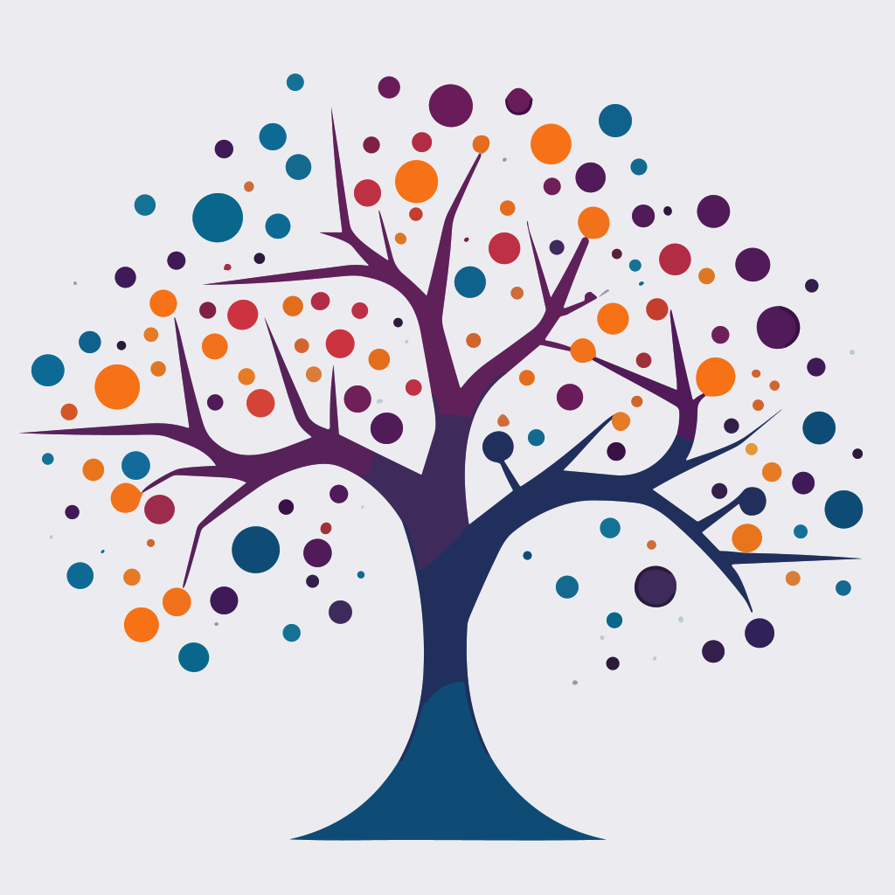

# Trendemia: Your Gateway to Accelerated Academic Research

Welcome to Trendemia, an AI-powered research analysis tool that has been meticulously crafted to serve the modern-day academic research community. We leverage the power of AI to transform how researchers interact with academic literature, thus streamlining the research process.

Our main goal is to help you stay at the forefront of your field by providing up-to-date information, accelerating your research process, and offering powerful trend visualizations.

The trendemia-starfield repository is home to our flagship visualization tool, which currently supports arXiv papers. This tool presents a unique view of academic literature, bringing insights and trends to the forefront.

## Core Features

1. **Accelerated Research**: Streamline your research process with our AI tool that significantly reduces the time spent searching for relevant literature and terminology.

2. **Trend Visualization**: Instantly access intuitive insights and visual representations of trends within specified research fields, enabling you to understand complex patterns and directions at a glance.

3. **Up-to-Date Information**: Stay updated with the latest progress in your area of interest, ensuring you always stay ahead in your field.

## Roadmap

1. Arxiv Paper visualization: [starfield.trendemia.org](https://starfield.trendemia.org)
2. Search
3. Dynamic loading
4. Topic modeling
5. Checkout relevant paper
6. paper summarization

## Datasets

As a initial step we support the Arxiv Dataset with 1.7+ Million papers:

- [Arxiv](https://www.kaggle.com/datasets/Cornell-University/arxiv)

## Contributing

Your contributions are always welcome! Please have a look at the [contribution guidelines](./CONTRIBUTING.md) first. 🎉

## License

The project is available under the [MIT License](./LICENSE).

With Trendemia, you're not just accessing a tool, you're joining a community. We look forward to exploring the academic cosmos together.